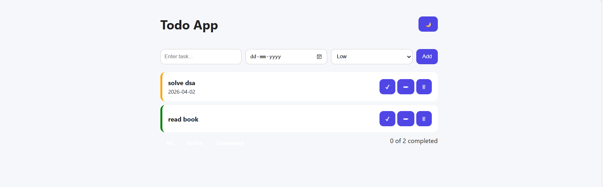
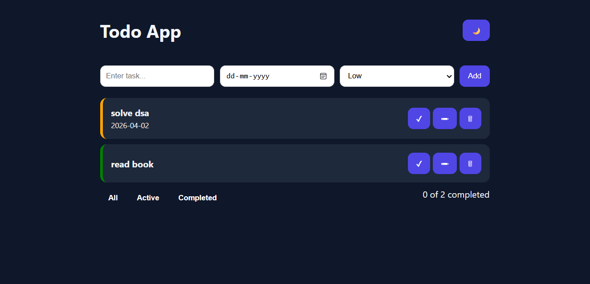

Todo App

A modern, feature-rich Todo Application built using HTML, CSS, and JavaScript — designed with clean UI, smooth UX, and real-world functionality.

✨ Features
✅ Add, Edit, Delete Tasks
✔️ Mark tasks as Completed
🔍 Filter Tasks (All / Active / Completed)
🎯 Priority Levels (High / Medium / Low) with color coding
📅 Due Date support
💾 Local Storage (data persists after refresh)
📊 Task Counter (e.g. 3 of 7 tasks completed)
🌙 Dark / Light Mode toggle
🎨 Smooth animations (add/delete)
📱 Fully Responsive (Mobile + Desktop)
🛠️ Tech Stack
HTML5
CSS3 (Flexbox, Responsive Design, Animations)
Vanilla JavaScript (ES6+)
LocalStorage API

📁 Project Structure
todo-app/
│── index.html
│── style.css
│── script.js
│── README.md

⚡ How to Run
Clone the repository
git clone https://github.com/your-username/todo-app.git
Open the project folder
Run index.html in your browser

🎯 Key Highlights
Clean and minimal UI design
Optimized DOM manipulation
Modular and readable code structure
No external libraries (pure JavaScript)
Beginner-friendly yet scalable

📸 Preview

🚀 Future Improvements
Drag & Drop tasks
Search functionality
Categories / Tags
Backend integration (Node.js + Database)
User authentication